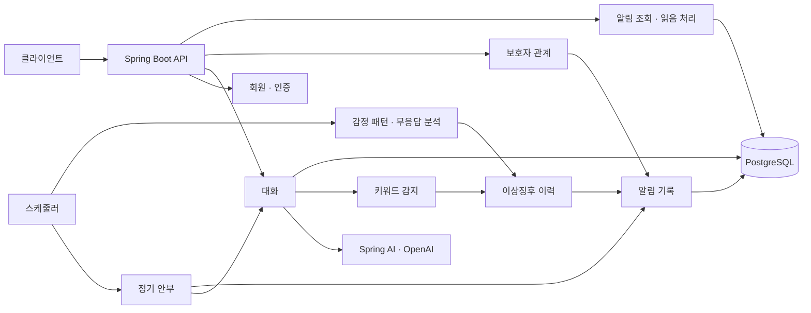

<div align="center">

# MARUNI

### 매일의 안부를 대화로, 대화의 기록을 돌봄으로

어르신의 일상 대화와 보호자의 안부 확인을 연결하는 **AI 돌봄 서비스 졸업작품**입니다.


[서비스 소개](#서비스-소개) · [주요 기능](#주요-기능) · [구조](#구조) · [실행 방법](#실행-방법) · [구현 범위](#구현-범위와-개선-과제)

</div>

---

## 서비스 소개

MARUNI는 어르신에게 정기적으로 안부 메시지를 제공하고, AI와 나눈 대화를 기록하며, 확인이 필요한 징후를 보호자용 알림으로 연결하는 서비스입니다. 어르신이 대화를 이어가는 흐름과 보호자가 안부를 확인하는 흐름을 하나의 제품으로 구성했습니다.

| 항목 | 내용 |
| --- | --- |
| 프로젝트 | 졸업작품, 졸업전시회 시연 완료 |
| 개발 | 김규일 1인 기획·프론트엔드·백엔드 개발 |
| 이 저장소 | Java·Spring 기반 서버 |
| 클라이언트 | [MARUNI-client](https://github.com/MARUNI-Service/MARUNI-client) |

## 주요 기능

| 기능 | 구현 내용 |
| --- | --- |
| **AI 대화** | 최근 대화 이력과 감정 분류 결과를 문맥으로 전달해 응답 생성, 사용자·AI 메시지 저장 |
| **정기 안부** | 스케줄러를 통한 안부 메시지 생성, 대화·알림 기록, 실패 처리와 재시도 예약 |
| **보호자 연결** | 보호자 등록 요청·수락·거절·관계 해제 |
| **징후 분석** | 감정 패턴·무응답·키워드별 분석 로직과 이상징후 이력 저장 |
| **알림함** | 안부·보호자 요청·이상징후 알림 통합 조회, 읽음 처리, 미확인 개수 조회 |
| **회원·인증** | 회원 관리, Spring Security와 JWT 기반 API 인증 |

AI 대화 응답은 Spring AI를 통해 OpenAI 모델을 호출합니다. 감정 분류는 설정된 키워드를 이용하는 별도 로직입니다. 현재 알림은 서버에 기록하고 클라이언트가 조회하는 범위이며, 상세한 제약은 아래에 정리했습니다.

## 구조



### 코드를 나눈 기준

- **대화 처리와 외부 AI 호출 분리:** `MessageProcessor`가 메시지 처리 흐름을 담당하고 `AIResponsePort`와 `OpenAIResponseAdapter`가 외부 모델 호출을 연결합니다.
- **분석 유형별 책임 분리:** 감정 패턴·무응답·키워드 분석을 `AnomalyAnalyzer` 구현체로 나누었습니다.
- **도메인별 알림 통합:** 안부 확인, 보호자 요청, 이상징후에서 생성한 알림을 유형·발생 원인과 함께 저장합니다.
- **보호자 관계의 상태 관리:** 요청과 수락·거절 절차를 거쳐 보호자 관계를 설정합니다.

```text
src/main/java/com/anyang/maruni/
├── domain/
│   ├── member/          회원
│   ├── auth/            인증
│   ├── conversation/    AI 대화와 메시지
│   ├── dailycheck/      정기 안부와 재시도
│   ├── guardian/        보호자 관계
│   ├── alertrule/       징후 분석과 이력
│   └── notification/    알림 기록과 조회
└── global/              보안 설정, 공통 응답, 예외 처리
```

각 도메인은 `application`·`domain`·`presentation` 계층을 중심으로 구성하며, 외부 연동 구현은 `infrastructure`에 둡니다.

## 기술 스택

| 영역 | 기술 |
| --- | --- |
| 서버 | Java 21, Spring Boot 3.3.5, Spring Web |
| 데이터 | Spring Data JPA, PostgreSQL 15 |
| 인증 | Spring Security, JWT |
| AI 연동 | Spring AI 1.0.0-M3, OpenAI |
| API 문서 | springdoc OpenAPI, Swagger UI |
| 실행 환경 | Docker, Docker Compose |
| 테스트 도구 | JUnit 5, Mockito, Spring Boot Test, H2, MockWebServer |

버전은 `build.gradle`과 `docker-compose.yml` 기준입니다.

## 실행 방법

### 1. 저장소 준비

```bash
git clone https://github.com/MARUNI-Service/MARUNI-SERVER.git
cd MARUNI-SERVER
```

### 2. 환경변수 설정

루트에 `.env` 파일을 만들고 아래 값을 자신의 개발 환경에 맞게 설정합니다. `.env`는 Git에서 제외됩니다.

```dotenv
DB_USERNAME=maruni
DB_PASSWORD=replace-with-your-local-db-password
JWT_SECRET_KEY=replace-with-a-random-secret-at-least-32-characters
JWT_ACCESS_EXPIRATION=3600000
OPENAI_API_KEY=replace-with-your-openai-api-key
ENCRYPTION_KEY=replace-with-32-byte-random-key!!
SPRING_PROFILES_ACTIVE=dev
SWAGGER_SERVER_URL=http://localhost:8080
```

`ENCRYPTION_KEY`에는 직접 생성한 32바이트 키를 사용합니다. OpenAI 대화 기능에는 유효한 API 키가 필요합니다.

### 3. 서버와 DB 실행

Docker와 Docker Compose가 설치된 환경에서 실행합니다.

```bash
docker compose up --build -d db app
```

| 경로 | 용도 |
| --- | --- |
| `http://localhost:8080/swagger-ui/index.html` | API 문서 |
| `http://localhost:8080/actuator/health` | 상태 확인 |

개발 프로필의 DB 호스트는 Compose 서비스명인 `db`입니다. IDE에서 서버를 실행하려면 데이터소스 URL을 로컬 DB 주소로 재설정해야 합니다.

```bash
docker compose logs -f app
docker compose down
```

### 테스트

로컬에 JDK 21을 준비한 뒤 실행합니다.

```bash
./gradlew test
```

테스트 소스는 `src/test`에 있습니다. Dockerfile의 이미지 빌드 단계는 테스트를 건너뛰므로 테스트 실행 결과는 별도로 확인해야 합니다.

## 구현 범위와 개선 과제

졸업전시회에서 시연한 프로젝트입니다. 현재 저장소의 구현 범위를 기준으로 다음 개선 과제를 남깁니다.

- **알림 전달:** 현재는 알림 레코드 생성·조회까지 구현되어 있습니다. 실제 FCM 푸시 전달과 수신 확인은 별도 연동이 필요합니다.
- **무응답 판정:** 안부 메시지 처리 성공과 사용자의 실제 응답을 별도 상태로 관리하도록 개선해야 합니다. 현재 분석기는 안부 처리 기록의 성공 여부를 참조합니다.
- **외부 AI 지연:** 대화 처리 트랜잭션에서 AI를 동기 호출합니다. 키워드 감지도 응답 생성 뒤에 실행되므로 호출 지연과 감지 순서를 개선할 여지가 있습니다.
- **감정·징후 분석 검증:** 현재 규칙 기반 분석의 오탐·미탐을 평가하고, 실제 돌봄 환경에서 사용할 기준을 검증하는 작업이 남아 있습니다.

## 더 살펴보기

- [사용자 여정 설계](docs/roadmap/user-journey.md)
- [프론트엔드 API 가이드](docs/frontend-api-guide.md)
- [도메인별 문서](docs/domains/README.md)
- [서버 소스](src/main/java/com/anyang/maruni)
- [테스트 소스](src/test/java/com/anyang/maruni)

기존 상세 문서에는 개발 당시의 계획과 이전 구현 설명이 함께 남아 있습니다. 현재 지원 범위와 버전은 이 README 및 실제 코드를 기준으로 확인해 주세요.
