# MARUNI 프로젝트 컨테이너 다이어그램

**노인 돌봄을 위한 AI 기반 소통 서비스의 시스템 아키텍처 및 컨테이너 구조**

## 📋 문서 개요

이 문서는 MARUNI 프로젝트의 **컨테이너 레벨 아키텍처**를 시각화하고, 각 컨테이너 간의 관계와 통신 방식을 설명합니다.

### 🎯 아키텍처 개요
- **마이크로서비스 지향**: Spring Boot 애플리케이션 중심
- **컨테이너화**: Docker + Docker Compose
- **데이터 영속성**: PostgreSQL + Redis
- **외부 서비스**: Firebase FCM, OpenAI GPT-4o

---

## 🏗️ 전체 시스템 컨테이너 다이어그램

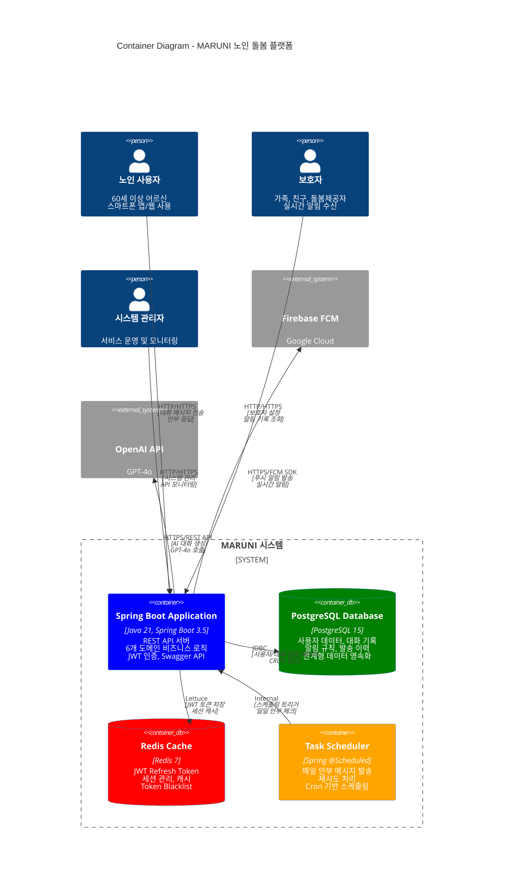

---

## 🐳 Docker 컨테이너 구성

### 📦 **컨테이너 목록 (3개 컨테이너)**

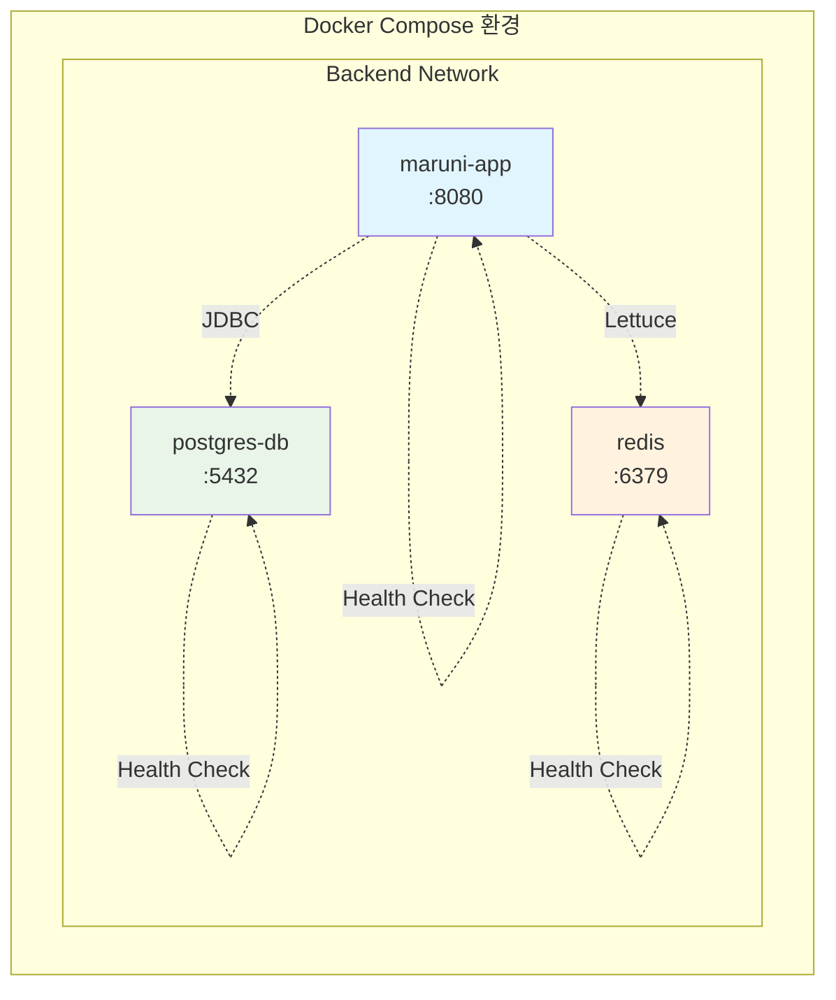

#### **1. maruni-app (Spring Boot 애플리케이션)**
```dockerfile
# Multi-stage build 최적화
FROM gradle:8.5-jdk21 AS builder
FROM openjdk:21-jdk-slim

WORKDIR /app
EXPOSE 8080
HEALTHCHECK --interval=30s --timeout=3s CMD curl -f http://localhost:8080/actuator/health
```

- **기술 스택**: Java 21, Spring Boot 3.5, Gradle 8.5
- **포트**: 8080
- **헬스체크**: `/actuator/health` 엔드포인트
- **프로파일**: `dev`, `prod` 환경별 설정

#### **2. postgres-db (PostgreSQL 데이터베이스)**
```yaml
image: postgres:15
environment:
  POSTGRES_DB: maruni-db
  POSTGRES_USER: ${DB_USERNAME}
  POSTGRES_PASSWORD: ${DB_PASSWORD}
```

- **버전**: PostgreSQL 15
- **포트**: 5432
- **볼륨**: `postgres-data` (영속적 데이터 저장)
- **헬스체크**: `pg_isready` 명령어

#### **3. redis (Redis 캐시)**
```yaml
image: redis:7
command: ["redis-server", "--requirepass", "${REDIS_PASSWORD}", "--appendonly", "yes"]
```

- **버전**: Redis 7
- **포트**: 6379
- **인증**: 비밀번호 보호
- **볼륨**: `redis-data` (AOF 영속화)

---

## 🔗 컨테이너 간 통신

### 📡 **내부 네트워크 통신**

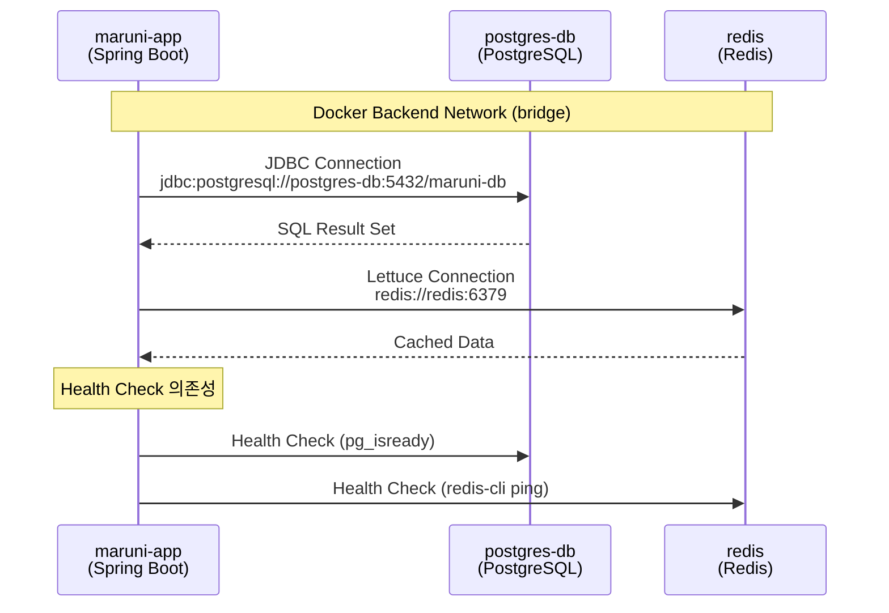

#### **네트워크 설정**
```yaml
networks:
  backend:
    driver: bridge
```

- **네트워크명**: `backend`
- **드라이버**: `bridge` (기본 Docker 네트워크)
- **통신 방식**: 컨테이너명으로 내부 DNS 해결

### 🌐 **외부 서비스 통신**

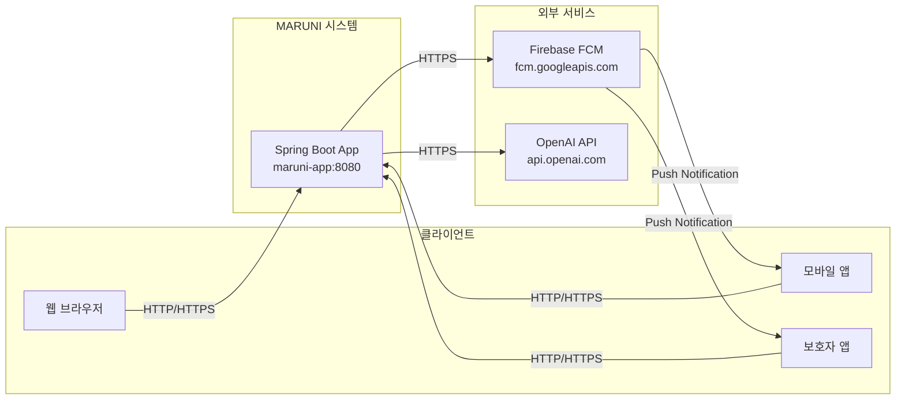

---

## 📊 도메인별 컨테이너 매핑

### 🏗️ **Spring Boot 애플리케이션 내부 구조**

```mermaid
graph TB
    subgraph "maruni-app Container (Port: 8080)"
        subgraph "Presentation Layer"
            API[REST API Controllers<br/>25+ Endpoints<br/>JWT + @AutoApiResponse]
            Swagger[Swagger UI<br/>/swagger-ui.html<br/>OpenAPI 3.0 문서화]
            Security[Spring Security<br/>JWT Filter Chain<br/>Authentication/Authorization]
        end

        subgraph "Application Layer (6개 도메인)"
            subgraph "Foundation Services"
                Auth[Auth Service<br/>- Token 발급/검증<br/>- Refresh Token 관리<br/>- Redis 기반 Blacklist]
                Member[Member Service<br/>- 회원 가입/조회<br/>- 프로필 관리<br/>- BCrypt 암호화]
            end

            subgraph "Core Services"
                Conversation[Conversation Service<br/>- OpenAI GPT-4o 연동<br/>- 감정 분석 (3단계)<br/>- 대화 세션 관리]
                DailyCheck[DailyCheck 시스템<br/>- DailyCheckScheduler<br/>- DailyCheckOrchestrator<br/>- RetryService (재시도)]
                Guardian[Guardian Service<br/>- 보호자 관계 관리<br/>- 알림 설정<br/>- 권한 제어]
            end

            subgraph "Integration Services"
                AlertRule[AlertRule Service<br/>- 3종 감지 알고리즘<br/>- 실시간 키워드 분석<br/>- 이상징후 판정]
                Notification[Notification Service<br/>- FCM 푸시 알림<br/>- Mock/Real 환경 분리<br/>- 발송 이력 관리]
            end
        end

        subgraph "Infrastructure Layer"
            subgraph "Data Access"
                JPA[Spring Data JPA<br/>- PostgreSQL 연동<br/>- Custom Repository<br/>- Query Method]
                Redis_Client[Redis Client (Lettuce)<br/>- JWT Token Store<br/>- Session Cache<br/>- Connection Pool]
            end

            subgraph "External Integrations"
                Scheduler[Spring Scheduler<br/>- @Scheduled Cron<br/>- Async Task<br/>- Error Handling]
                Firebase_SDK[Firebase SDK<br/>- FCM Push Service<br/>- Token Management<br/>- Batch Notification]
                OpenAI_Client[OpenAI Client<br/>- Spring AI Framework<br/>- GPT-4o Integration<br/>- Emotion Analysis]
            end
        end
    end

    %% API Layer Connections
    API -.-> Security
    Security -.-> Auth
    API --> Member
    API --> Conversation
    API --> Guardian
    API --> AlertRule

    %% Service Layer Connections
    Auth --> Redis_Client
    Member --> JPA
    Conversation --> JPA
    Conversation --> OpenAI_Client
    DailyCheck --> JPA
    DailyCheck --> Notification
    Guardian --> JPA
    AlertRule --> JPA
    AlertRule --> Notification
    Notification --> Firebase_SDK

    %% Scheduler Connections
    Scheduler --> DailyCheck

    %% Cross-Domain Dependencies
    AlertRule -.-> Guardian
    DailyCheck -.-> Member
    Notification -.-> Guardian

    %% Styling
    classDef foundation fill:#e3f2fd,stroke:#1976d2,stroke-width:2px
    classDef core fill:#f3e5f5,stroke:#7b1fa2,stroke-width:2px
    classDef integration fill:#e8f5e8,stroke:#388e3c,stroke-width:2px
    classDef infrastructure fill:#fff3e0,stroke:#f57c00,stroke-width:2px

    class Auth,Member foundation
    class Conversation,DailyCheck,Guardian core
    class AlertRule,Notification integration
    class JPA,Redis_Client,Scheduler,Firebase_SDK,OpenAI_Client infrastructure
```

### 📋 **상세 데이터 저장소 매핑**

#### 🗄️ **PostgreSQL 테이블 구조 (실제 코드 기준)**

| 도메인 | 테이블명 | 주요 컬럼 | 관계 | 용도 |
|--------|----------|-----------|------|------|
| **Member** | `member_table` | `id`, `memberEmail`, `memberName`, `memberPassword`, `guardian_id`, `push_token` | `guardian.id` (FK) | 회원 정보 + FCM |
| **Auth** | `refresh_token` | `id`, `member_id`, `token`, `expires_at`, `created_at` | `member_table.id` (FK) | JWT Refresh Token 저장 |
| **Conversation** | `conversations` | `id`, `member_id`, `session_id`, `status`, `created_at` | `member_table.id` (FK) | AI 대화 세션 |
| **Conversation** | `messages` | `id`, `conversation_id`, `content`, `message_type`, `emotion_type`, `ai_response` | `conversations.id` (FK) | 대화 메시지 내역 |
| **DailyCheck** | `daily_check_records` | `id`, `memberId`, `checkDate`, `message`, `success`, `created_at`, `updated_at` | `member_table.id` (FK) | 일일 안부 확인 기록 |
| **DailyCheck** | `retry_records` | `id`, `daily_check_id`, `retry_attempt`, `retry_at`, `error_message`, `success` | `daily_check_records.id` (FK) | 재시도 이력 |
| **Guardian** | `guardian` | `id`, `guardianName`, `guardianEmail`, `guardianPhone`, `relation`, `notificationPreference`, `isActive` | - | 보호자 기본 정보 |
| **AlertRule** | `alert_rule` | `id`, `member_id`, `rule_type`, `conditions`, `alert_level`, `is_active` | `member_table.id` (FK) | 이상징후 감지 규칙 |
| **AlertRule** | `alert_history` | `id`, `member_id`, `alert_rule_id`, `triggered_at`, `alert_content`, `resolved_at` | `member_table.id`, `alert_rule.id` (FK) | 알림 발생 이력 |

#### 🔄 **Redis 캐시 구조 (5개 키 패턴)**

| 도메인 | Redis 키 패턴 | TTL | 데이터 구조 | 용도 |
|--------|---------------|-----|-------------|------|
| **Auth** | `refreshToken:{memberId}` | 24시간 | String | Refresh Token 저장 |
| **Auth** | `blacklist:token:{tokenHash}` | Access Token TTL | String | 무효화된 토큰 관리 |
| **Auth** | `loginAttempt:{email}` | 15분 | Counter | 로그인 시도 횟수 제한 |
| **Conversation** | `conversation:session:{sessionId}` | 1시간 | Hash | 대화 세션 임시 저장 |
| **DailyCheck** | `dailycheck:lock:{memberId}:{date}` | 24시간 | String | 중복 발송 방지 |

### 🔗 **도메인 간 의존성 매핑**

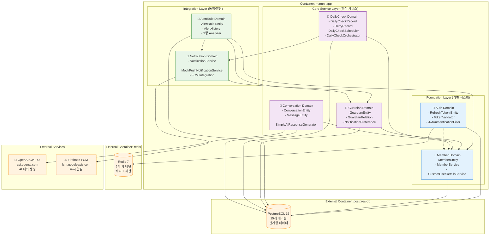

### 🏗️ **컨테이너별 리소스 할당**

#### 📊 **maruni-app Container (Spring Boot)**

```yaml
# docker-compose.yml 리소스 설정
services:
  app:
    deploy:
      resources:
        limits:
          cpus: '1.0'          # CPU 1코어
          memory: 2G           # 메모리 2GB
        reservations:
          cpus: '0.5'          # CPU 최소 0.5코어
          memory: 1G           # 메모리 최소 1GB
    environment:
      # JVM 힙 설정
      JAVA_OPTS: >
        -Xms1g -Xmx1.5g
        -XX:+UseG1GC
        -XX:MaxGCPauseMillis=200
        -XX:+UnlockExperimentalVMOptions
        -XX:+UseContainerSupport
      # 도메인별 스레드 풀 설정
      SPRING_TASK_EXECUTION_POOL_CORE_SIZE: 10
      SPRING_TASK_EXECUTION_POOL_MAX_SIZE: 20
      SPRING_TASK_SCHEDULING_POOL_SIZE: 5
```

#### 🗄️ **postgres-db Container (PostgreSQL)**

```yaml
services:
  db:
    deploy:
      resources:
        limits:
          cpus: '0.5'          # CPU 0.5코어
          memory: 1G           # 메모리 1GB
        reservations:
          cpus: '0.25'         # CPU 최소 0.25코어
          memory: 512M         # 메모리 최소 512MB
    environment:
      # PostgreSQL 성능 튜닝
      POSTGRES_SHARED_BUFFERS: 256MB
      POSTGRES_EFFECTIVE_CACHE_SIZE: 512MB
      POSTGRES_WORK_MEM: 4MB
      POSTGRES_MAINTENANCE_WORK_MEM: 64MB
      POSTGRES_MAX_CONNECTIONS: 100
```

#### 🔄 **redis Container (Redis)**

```yaml
services:
  redis:
    deploy:
      resources:
        limits:
          cpus: '0.25'         # CPU 0.25코어
          memory: 512M         # 메모리 512MB
        reservations:
          cpus: '0.1'          # CPU 최소 0.1코어
          memory: 128M         # 메모리 최소 128MB
    environment:
      # Redis 메모리 최적화
      REDIS_MAXMEMORY: 256mb
      REDIS_MAXMEMORY_POLICY: allkeys-lru
      REDIS_SAVE: '900 1 300 10 60 10000'  # 스냅샷 설정
```

### 🔄 **도메인별 처리 플로우 매핑**

#### 💬 **AI 대화 처리 플로우**
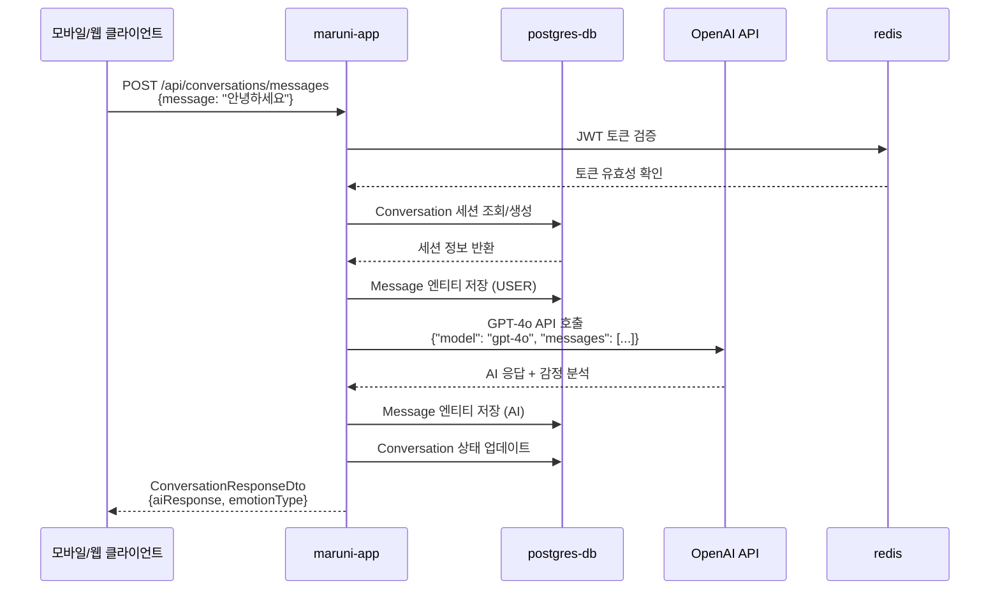

#### 📅 **일일 안부 확인 플로우**
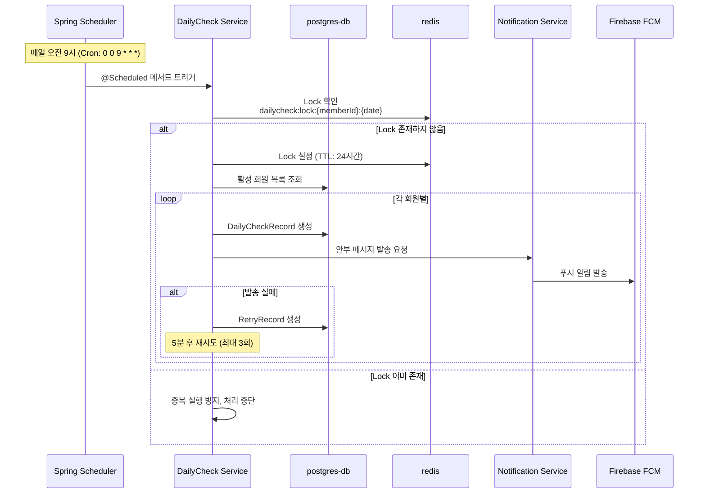

#### 🚨 **이상징후 감지 플로우**
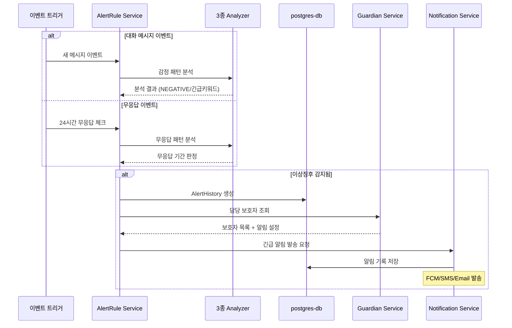

---

## ⚙️ 환경별 컨테이너 설정

### 🔧 **개발 환경 (dev)**

```yaml
# docker-compose.yml
version: '3.8'
services:
  app:
    environment:
      SPRING_PROFILES_ACTIVE: dev
      SWAGGER_SERVER_URL: http://localhost:8080
    ports:
      - "8080:8080"
```

**설정 특징:**
- **AI 서비스**: Mock 서비스 (OpenAI API 절약)
- **알림 서비스**: Mock 푸시 알림
- **데이터베이스**: 로컬 PostgreSQL
- **Swagger**: 활성화 (`/swagger-ui.html`)

### 🚀 **운영 환경 (prod)**

```yaml
# docker-compose.prod.yml
version: '3.8'
services:
  app:
    environment:
      SPRING_PROFILES_ACTIVE: prod
      SWAGGER_SERVER_URL: https://api.maruni.com
    deploy:
      replicas: 2
      resources:
        limits:
          cpus: '1.0'
          memory: 2G
```

**설정 특징:**
- **AI 서비스**: 실제 OpenAI GPT-4o 연동
- **알림 서비스**: Firebase FCM 실제 연동
- **보안**: HTTPS, JWT 보안 강화
- **Swagger**: 비활성화 (보안)
- **스케일링**: 다중 인스턴스 배포

---

## 🔒 보안 및 네트워킹

### 🛡️ **보안 설정**

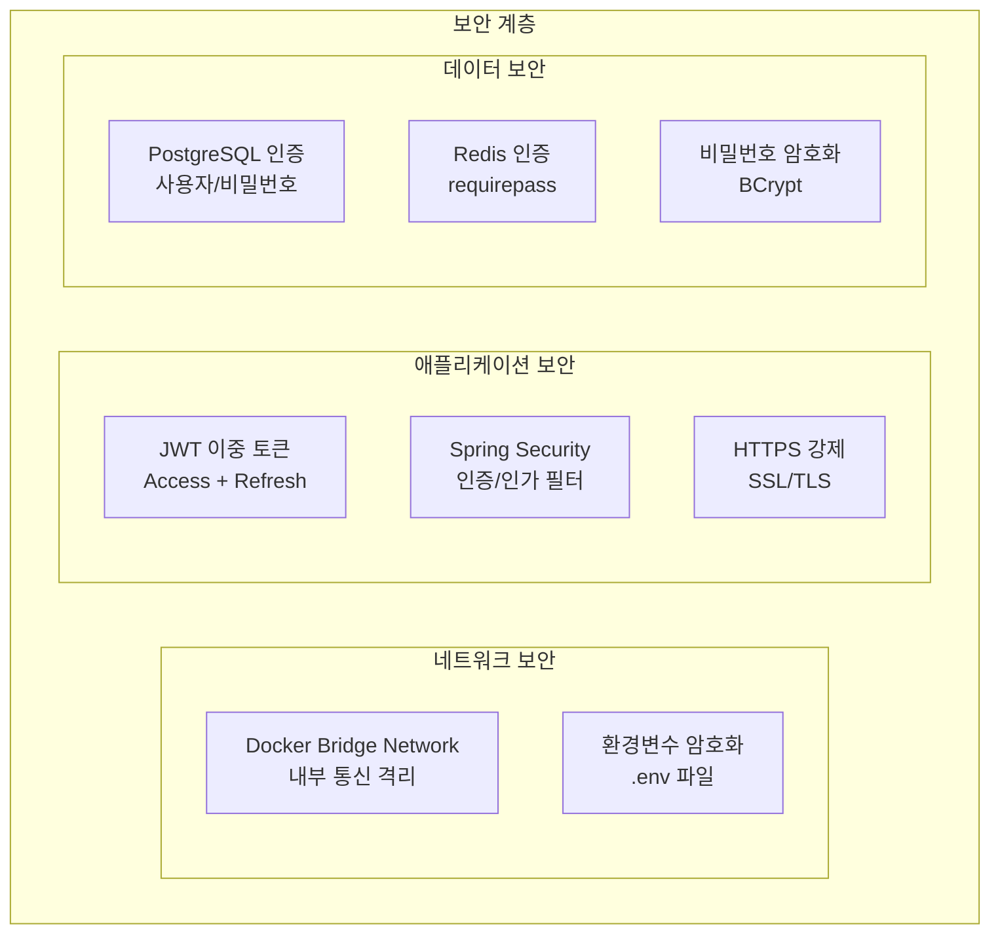

#### **환경변수 보안**
```bash
# .env (환경별 분리)
DB_USERNAME=secure_db_user
DB_PASSWORD=secure_db_password_32_chars
REDIS_PASSWORD=secure_redis_password
JWT_SECRET_KEY=jwt_secret_key_at_least_32_characters
OPENAI_API_KEY=sk-...
```

#### **네트워크 격리**
- **내부 통신**: Docker 내부 네트워크만 허용
- **외부 노출**: 애플리케이션 포트(8080)만 외부 노출
- **데이터베이스**: 내부 네트워크에서만 접근 가능

### 🌐 **포트 매핑**

| 컨테이너 | 내부 포트 | 외부 포트 | 용도 |
|----------|-----------|-----------|------|
| `maruni-app` | 8080 | 8080 | REST API, Swagger UI |
| `postgres-db` | 5432 | 5432 | 개발용 DB 접근 |
| `redis` | 6379 | 6379 | 개발용 캐시 접근 |

**⚠️ 운영 환경**: 데이터베이스 포트는 외부 노출하지 않음

---

## 📈 헬스체크 및 모니터링

### 💊 **컨테이너 헬스체크**

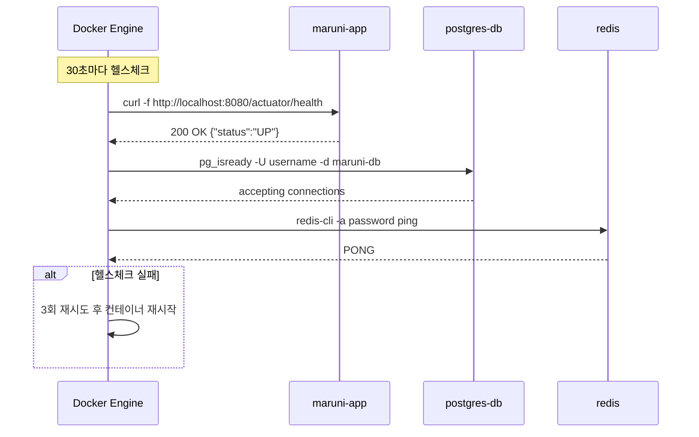

#### **헬스체크 설정**
```yaml
healthcheck:
  interval: 30s      # 체크 간격
  timeout: 10s       # 타임아웃
  retries: 3         # 재시도 횟수
  start_period: 60s  # 시작 유예 시간
```

### 📊 **모니터링 엔드포인트**

```http
GET /actuator/health          # 전체 헬스체크
GET /actuator/health/db       # 데이터베이스 상태
GET /actuator/health/redis    # Redis 상태
GET /actuator/metrics         # 애플리케이션 메트릭
GET /actuator/info           # 애플리케이션 정보
```

---

## 🚀 배포 및 스케일링

### 📦 **배포 프로세스**

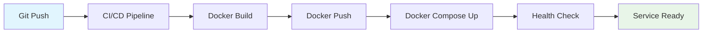

#### **배포 명령어**
```bash
# 개발 환경
docker-compose up -d

# 운영 환경 (스케일링)
docker-compose -f docker-compose.prod.yml up -d --scale app=2

# 무중단 배포
docker-compose -f docker-compose.prod.yml up -d --no-deps app
```

### 📈 **수평 스케일링**

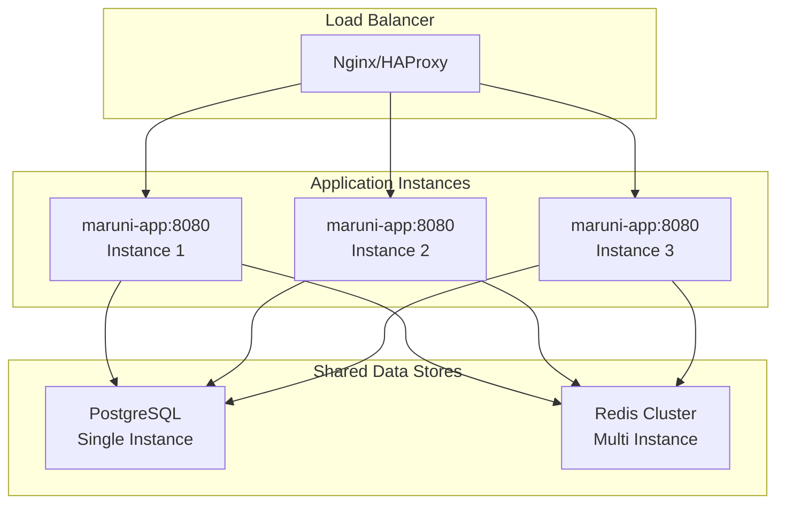

---

## 🔧 운영 관리

### 📊 **로그 관리**

```bash
# 컨테이너별 로그 조회
docker-compose logs -f app
docker-compose logs -f db
docker-compose logs -f redis

# 전체 로그
docker-compose logs -f

# 로그 크기 제한
logging:
  driver: "json-file"
  options:
    max-size: "10m"
    max-file: "3"
```

### 🔄 **백업 및 복구**

```bash
# PostgreSQL 백업
docker exec postgres-db pg_dump -U ${DB_USERNAME} maruni-db > backup.sql

# Redis 백업
docker exec redis redis-cli -a ${REDIS_PASSWORD} BGSAVE

# 볼륨 백업
docker run --rm -v postgres-data:/source -v $(pwd):/backup alpine tar czf /backup/postgres-backup.tar.gz -C /source .
```

### 🔍 **트러블슈팅**

#### **일반적인 문제들**

1. **컨테이너 시작 실패**
   ```bash
   # 헬스체크 상태 확인
   docker-compose ps

   # 로그 확인
   docker-compose logs app
   ```

2. **데이터베이스 연결 실패**
   ```bash
   # PostgreSQL 연결 테스트
   docker exec -it postgres-db psql -U ${DB_USERNAME} -d maruni-db

   # 네트워크 확인
   docker network ls
   docker network inspect maruni_backend
   ```

3. **Redis 연결 실패**
   ```bash
   # Redis 연결 테스트
   docker exec -it redis redis-cli -a ${REDIS_PASSWORD} ping

   # 메모리 사용량 확인
   docker exec redis redis-cli -a ${REDIS_PASSWORD} info memory
   ```

---

## 🎯 확장 계획

### 📱 **Phase 3: 마이크로서비스 확장**

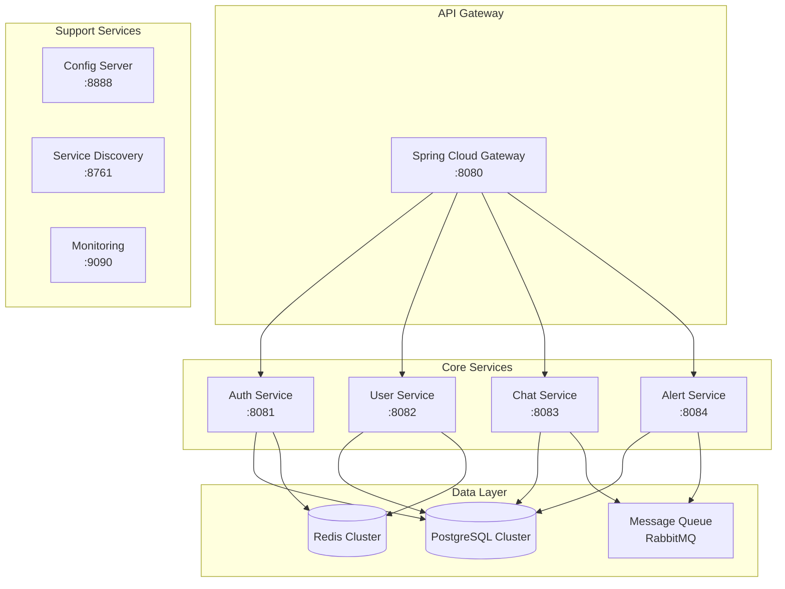

### 🔮 **향후 컨테이너 추가 계획**

| 서비스 | 기술 스택 | 포트 | 용도 |
|--------|-----------|------|------|
| **API Gateway** | Spring Cloud Gateway | 8080 | 라우팅, 로드밸런싱 |
| **Service Discovery** | Eureka | 8761 | 서비스 등록/발견 |
| **Config Server** | Spring Cloud Config | 8888 | 중앙 설정 관리 |
| **Message Queue** | RabbitMQ | 5672 | 비동기 메시징 |
| **Monitoring** | Prometheus + Grafana | 9090 | 메트릭 수집/시각화 |
| **Mobile API** | Flutter Backend | 8090 | 모바일 전용 API |

---

## 📋 문서 연관 관계

### 🔗 **관련 문서**
- **[유저 플로우 다이어그램](./user_flow_diagram.md)**: 사용자 여정 및 비즈니스 플로우
- **[전체 프로젝트 가이드](./README.md)**: 프로젝트 개요 및 현황
- **[도메인 구조](./domains/README.md)**: 비즈니스 도메인 아키텍처
- **[기술 스택](./specifications/tech-stack.md)**: 상세 기술 정보

### 🛠️ **인프라 문서**
- **[Docker 설정](../docker-compose.yml)**: 실제 컨테이너 구성
- **[Dockerfile](../Dockerfile)**: 애플리케이션 빌드 설정
- **[환경 설정](../src/main/resources/application.yml)**: Spring Boot 설정

---

**MARUNI는 Docker 기반의 마이크로서비스 지향 아키텍처로 구축된 확장 가능하고 안정적인 노인 돌봄 플랫폼입니다. 컨테이너화를 통해 개발/운영 환경의 일관성을 보장하고, 향후 클라우드 네이티브 확장을 위한 기반을 마련했습니다.** 🚀