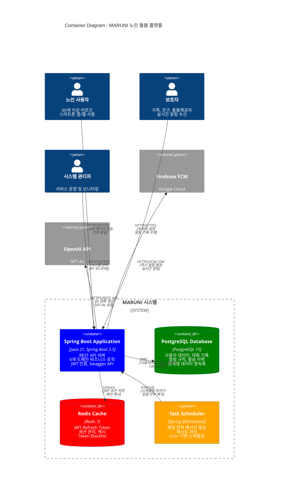
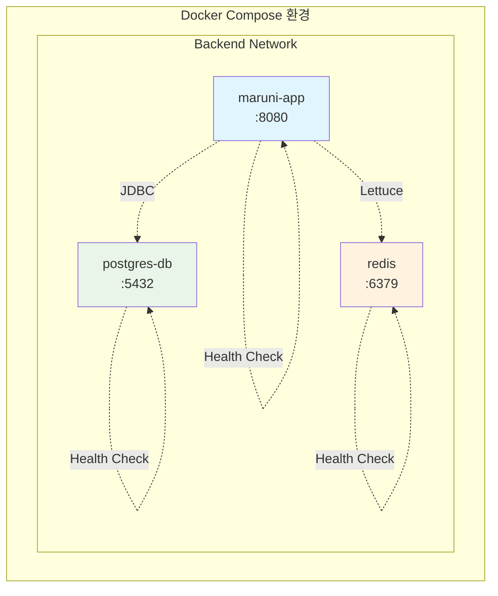
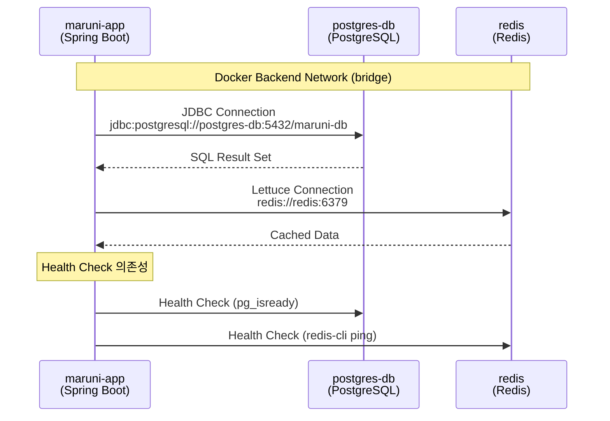
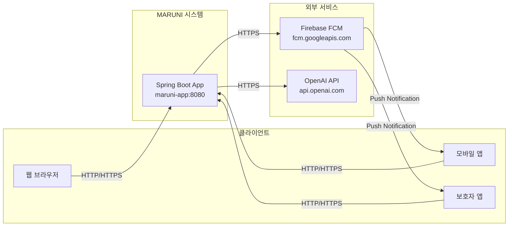
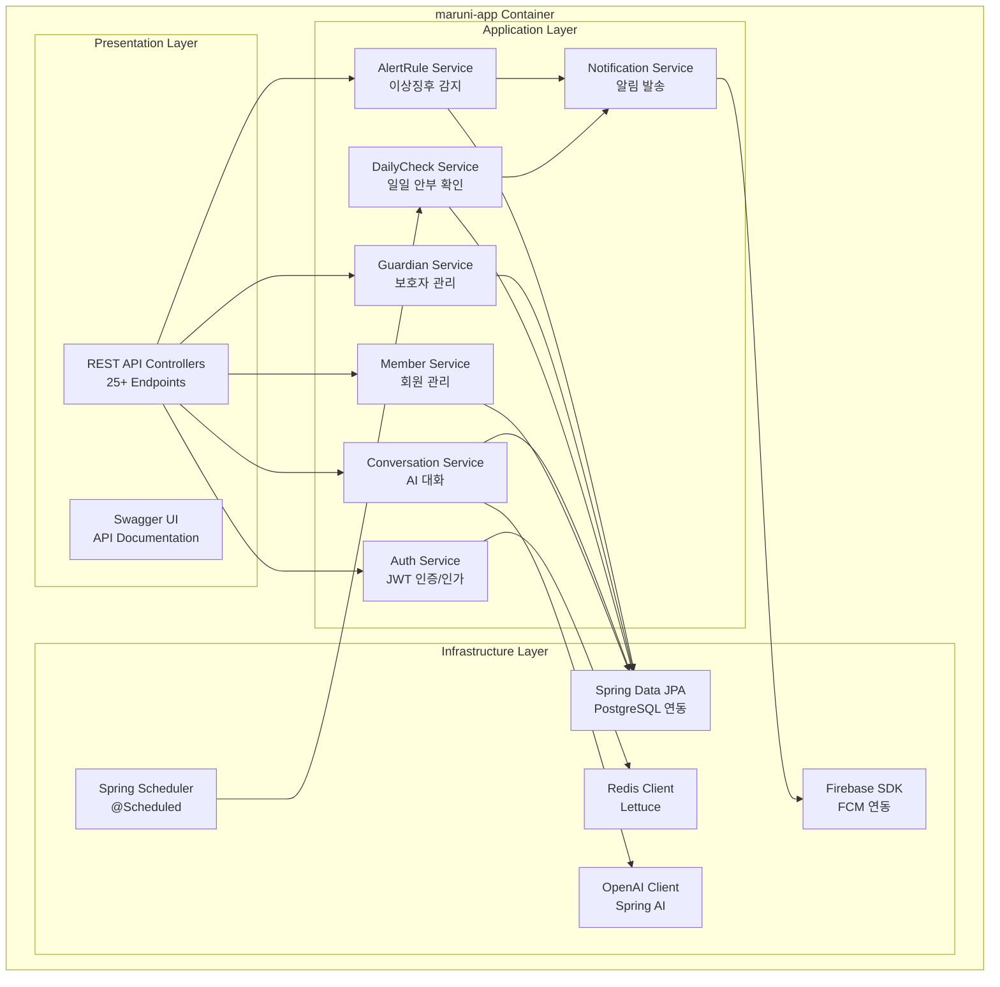
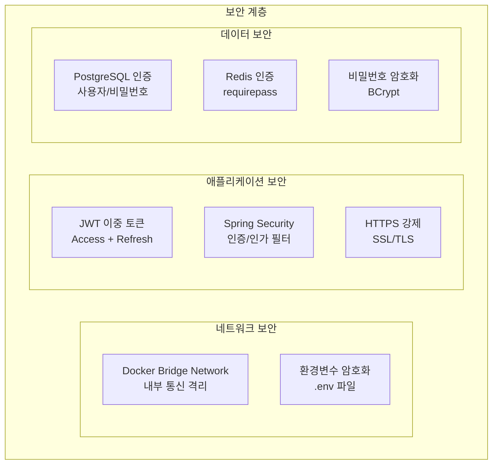
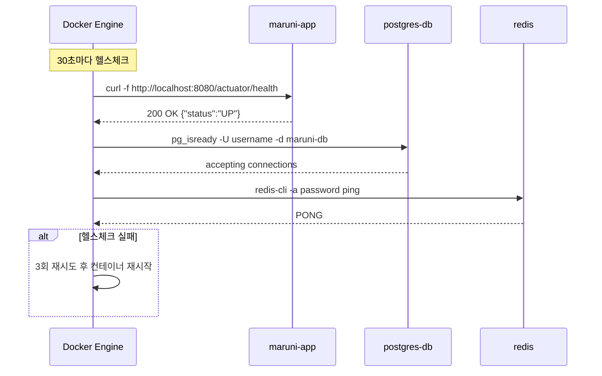
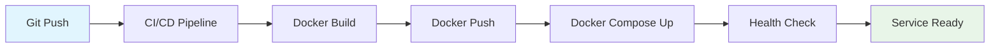
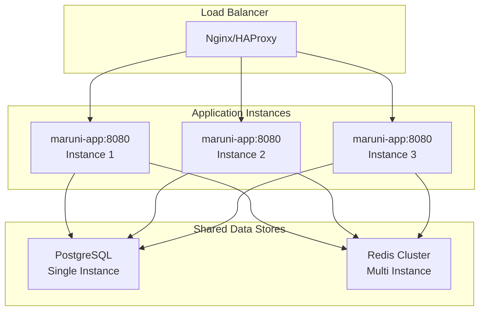
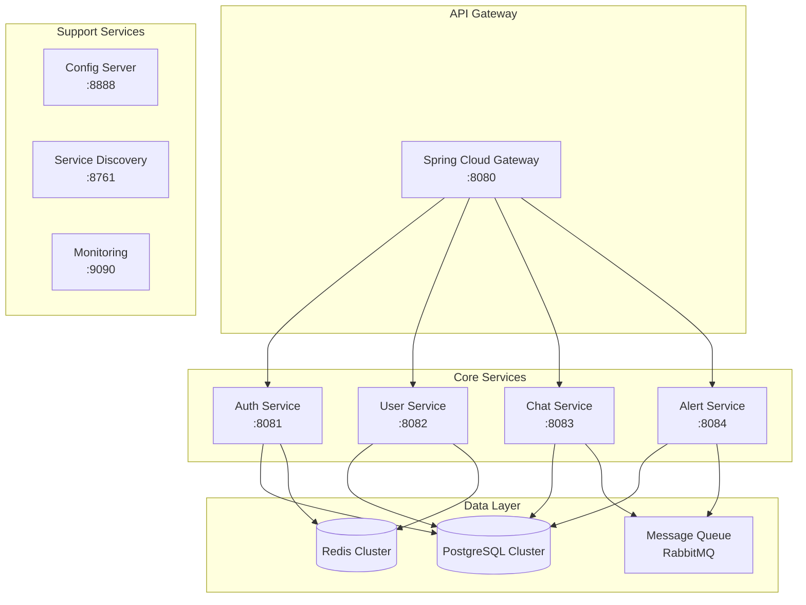

# MARUNI 프로젝트 컨테이너 다이어그램

**노인 돌봄을 위한 AI 기반 소통 서비스의 시스템 아키텍처 및 컨테이너 구조**

## 📋 문서 개요

이 문서는 MARUNI 프로젝트의 **컨테이너 레벨 아키텍처**를 시각화하고, 각 컨테이너 간의 관계와 통신 방식을 설명합니다.

### 🎯 아키텍처 개요
- **마이크로서비스 지향**: Spring Boot 애플리케이션 중심
- **컨테이너화**: Docker + Docker Compose
- **데이터 영속성**: PostgreSQL + Redis
- **외부 서비스**: Firebase FCM, OpenAI GPT-4o

---

## 🏗️ 전체 시스템 컨테이너 다이어그램



---

## 🐳 Docker 컨테이너 구성

### 📦 **컨테이너 목록 (3개 컨테이너)**



#### **1. maruni-app (Spring Boot 애플리케이션)**
```dockerfile
# Multi-stage build 최적화
FROM gradle:8.5-jdk21 AS builder
FROM openjdk:21-jdk-slim

WORKDIR /app
EXPOSE 8080
HEALTHCHECK --interval=30s --timeout=3s CMD curl -f http://localhost:8080/actuator/health
```

- **기술 스택**: Java 21, Spring Boot 3.5, Gradle 8.5
- **포트**: 8080
- **헬스체크**: `/actuator/health` 엔드포인트
- **프로파일**: `dev`, `prod` 환경별 설정

#### **2. postgres-db (PostgreSQL 데이터베이스)**
```yaml
image: postgres:15
environment:
  POSTGRES_DB: maruni-db
  POSTGRES_USER: ${DB_USERNAME}
  POSTGRES_PASSWORD: ${DB_PASSWORD}
```

- **버전**: PostgreSQL 15
- **포트**: 5432
- **볼륨**: `postgres-data` (영속적 데이터 저장)
- **헬스체크**: `pg_isready` 명령어

#### **3. redis (Redis 캐시)**
```yaml
image: redis:7
command: ["redis-server", "--requirepass", "${REDIS_PASSWORD}", "--appendonly", "yes"]
```

- **버전**: Redis 7
- **포트**: 6379
- **인증**: 비밀번호 보호
- **볼륨**: `redis-data` (AOF 영속화)

---

## 🔗 컨테이너 간 통신

### 📡 **내부 네트워크 통신**



#### **네트워크 설정**
```yaml
networks:
  backend:
    driver: bridge
```

- **네트워크명**: `backend`
- **드라이버**: `bridge` (기본 Docker 네트워크)
- **통신 방식**: 컨테이너명으로 내부 DNS 해결

### 🌐 **외부 서비스 통신**



---

## 📊 도메인별 컨테이너 매핑

### 🏗️ **Spring Boot 애플리케이션 내부 구조**



### 📋 **데이터 저장소 매핑**

| 도메인 | PostgreSQL 테이블 | Redis 키 | 용도 |
|--------|-------------------|----------|------|
| **Member** | `member_table` | - | 회원 정보, 프로필 |
| **Auth** | `refresh_token` | `refreshToken:{memberId}`<br/>`blacklist:token:{token}` | JWT 토큰 관리 |
| **Conversation** | `conversations`<br/>`messages` | - | AI 대화 기록 |
| **DailyCheck** | `daily_check_records`<br/>`retry_records` | - | 안부 확인 기록 |
| **Guardian** | `guardian` | - | 보호자 정보, 관계 |
| **AlertRule** | `alert_rule`<br/>`alert_history` | - | 알림 규칙, 이력 |
| **Notification** | `notification_history` | - | 알림 발송 기록 |

---

## ⚙️ 환경별 컨테이너 설정

### 🔧 **개발 환경 (dev)**

```yaml
# docker-compose.yml
version: '3.8'
services:
  app:
    environment:
      SPRING_PROFILES_ACTIVE: dev
      SWAGGER_SERVER_URL: http://localhost:8080
    ports:
      - "8080:8080"
```

**설정 특징:**
- **AI 서비스**: Mock 서비스 (OpenAI API 절약)
- **알림 서비스**: Mock 푸시 알림
- **데이터베이스**: 로컬 PostgreSQL
- **Swagger**: 활성화 (`/swagger-ui.html`)

### 🚀 **운영 환경 (prod)**

```yaml
# docker-compose.prod.yml
version: '3.8'
services:
  app:
    environment:
      SPRING_PROFILES_ACTIVE: prod
      SWAGGER_SERVER_URL: https://api.maruni.com
    deploy:
      replicas: 2
      resources:
        limits:
          cpus: '1.0'
          memory: 2G
```

**설정 특징:**
- **AI 서비스**: 실제 OpenAI GPT-4o 연동
- **알림 서비스**: Firebase FCM 실제 연동
- **보안**: HTTPS, JWT 보안 강화
- **Swagger**: 비활성화 (보안)
- **스케일링**: 다중 인스턴스 배포

---

## 🔒 보안 및 네트워킹

### 🛡️ **보안 설정**



#### **환경변수 보안**
```bash
# .env (환경별 분리)
DB_USERNAME=secure_db_user
DB_PASSWORD=secure_db_password_32_chars
REDIS_PASSWORD=secure_redis_password
JWT_SECRET_KEY=jwt_secret_key_at_least_32_characters
OPENAI_API_KEY=sk-...
```

#### **네트워크 격리**
- **내부 통신**: Docker 내부 네트워크만 허용
- **외부 노출**: 애플리케이션 포트(8080)만 외부 노출
- **데이터베이스**: 내부 네트워크에서만 접근 가능

### 🌐 **포트 매핑**

| 컨테이너 | 내부 포트 | 외부 포트 | 용도 |
|----------|-----------|-----------|------|
| `maruni-app` | 8080 | 8080 | REST API, Swagger UI |
| `postgres-db` | 5432 | 5432 | 개발용 DB 접근 |
| `redis` | 6379 | 6379 | 개발용 캐시 접근 |

**⚠️ 운영 환경**: 데이터베이스 포트는 외부 노출하지 않음

---

## 📈 헬스체크 및 모니터링

### 💊 **컨테이너 헬스체크**



#### **헬스체크 설정**
```yaml
healthcheck:
  interval: 30s      # 체크 간격
  timeout: 10s       # 타임아웃
  retries: 3         # 재시도 횟수
  start_period: 60s  # 시작 유예 시간
```

### 📊 **모니터링 엔드포인트**

```http
GET /actuator/health          # 전체 헬스체크
GET /actuator/health/db       # 데이터베이스 상태
GET /actuator/health/redis    # Redis 상태
GET /actuator/metrics         # 애플리케이션 메트릭
GET /actuator/info           # 애플리케이션 정보
```

---

## 🚀 배포 및 스케일링

### 📦 **배포 프로세스**



#### **배포 명령어**
```bash
# 개발 환경
docker-compose up -d

# 운영 환경 (스케일링)
docker-compose -f docker-compose.prod.yml up -d --scale app=2

# 무중단 배포
docker-compose -f docker-compose.prod.yml up -d --no-deps app
```

### 📈 **수평 스케일링**



---

## 🔧 운영 관리

### 📊 **로그 관리**

```bash
# 컨테이너별 로그 조회
docker-compose logs -f app
docker-compose logs -f db
docker-compose logs -f redis

# 전체 로그
docker-compose logs -f

# 로그 크기 제한
logging:
  driver: "json-file"
  options:
    max-size: "10m"
    max-file: "3"
```

### 🔄 **백업 및 복구**

```bash
# PostgreSQL 백업
docker exec postgres-db pg_dump -U ${DB_USERNAME} maruni-db > backup.sql

# Redis 백업
docker exec redis redis-cli -a ${REDIS_PASSWORD} BGSAVE

# 볼륨 백업
docker run --rm -v postgres-data:/source -v $(pwd):/backup alpine tar czf /backup/postgres-backup.tar.gz -C /source .
```

### 🔍 **트러블슈팅**

#### **일반적인 문제들**

1. **컨테이너 시작 실패**
   ```bash
   # 헬스체크 상태 확인
   docker-compose ps

   # 로그 확인
   docker-compose logs app
   ```

2. **데이터베이스 연결 실패**
   ```bash
   # PostgreSQL 연결 테스트
   docker exec -it postgres-db psql -U ${DB_USERNAME} -d maruni-db

   # 네트워크 확인
   docker network ls
   docker network inspect maruni_backend
   ```

3. **Redis 연결 실패**
   ```bash
   # Redis 연결 테스트
   docker exec -it redis redis-cli -a ${REDIS_PASSWORD} ping

   # 메모리 사용량 확인
   docker exec redis redis-cli -a ${REDIS_PASSWORD} info memory
   ```

---

## 🎯 확장 계획

### 📱 **Phase 3: 마이크로서비스 확장**



### 🔮 **향후 컨테이너 추가 계획**

| 서비스 | 기술 스택 | 포트 | 용도 |
|--------|-----------|------|------|
| **API Gateway** | Spring Cloud Gateway | 8080 | 라우팅, 로드밸런싱 |
| **Service Discovery** | Eureka | 8761 | 서비스 등록/발견 |
| **Config Server** | Spring Cloud Config | 8888 | 중앙 설정 관리 |
| **Message Queue** | RabbitMQ | 5672 | 비동기 메시징 |
| **Monitoring** | Prometheus + Grafana | 9090 | 메트릭 수집/시각화 |
| **Mobile API** | Flutter Backend | 8090 | 모바일 전용 API |

---

## 📋 문서 연관 관계

### 🔗 **관련 문서**
- **[유저 플로우 다이어그램](./user_flow_diagram.md)**: 사용자 여정 및 비즈니스 플로우
- **[전체 프로젝트 가이드](./README.md)**: 프로젝트 개요 및 현황
- **[도메인 구조](./domains/README.md)**: 비즈니스 도메인 아키텍처
- **[기술 스택](./specifications/tech-stack.md)**: 상세 기술 정보

### 🛠️ **인프라 문서**
- **[Docker 설정](../docker-compose.yml)**: 실제 컨테이너 구성
- **[Dockerfile](../Dockerfile)**: 애플리케이션 빌드 설정
- **[환경 설정](../src/main/resources/application.yml)**: Spring Boot 설정

---

**MARUNI는 Docker 기반의 마이크로서비스 지향 아키텍처로 구축된 확장 가능하고 안정적인 노인 돌봄 플랫폼입니다. 컨테이너화를 통해 개발/운영 환경의 일관성을 보장하고, 향후 클라우드 네이티브 확장을 위한 기반을 마련했습니다.** 🚀