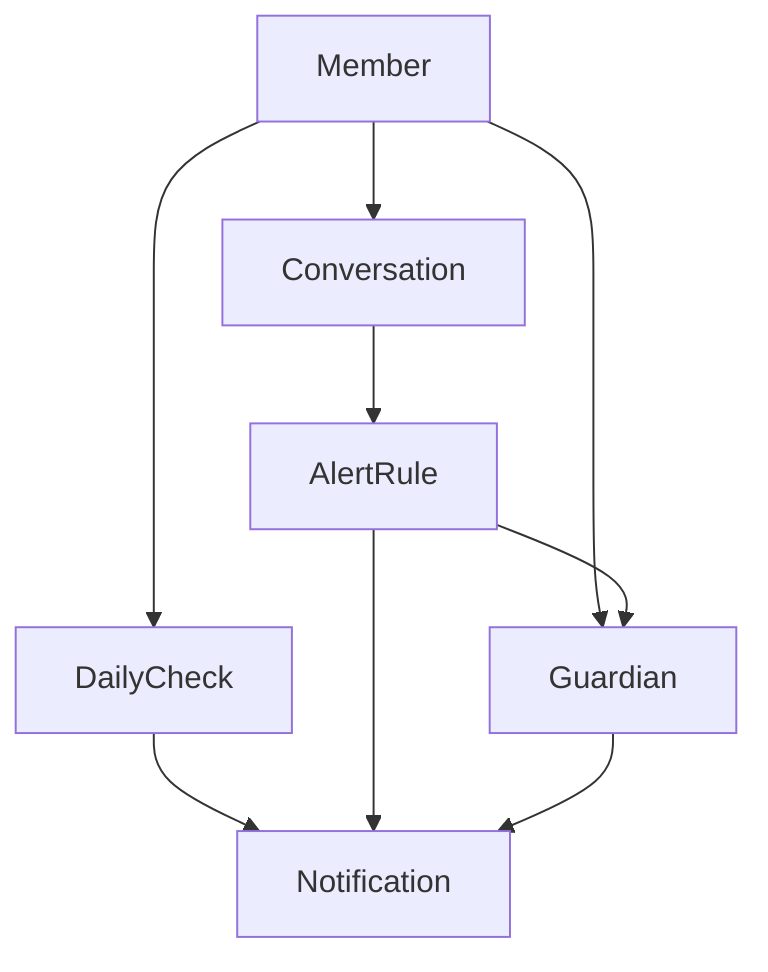

# 도메인별 구현 가이드

**MARUNI 6개 핵심 도메인의 완전한 구현 가이드 모음**

## 🏗️ 도메인 아키텍처 개요

### **도메인 계층 구조**
```
🔐 Foundation Layer (기반)
├── Member (회원 관리) ✅
└── Auth (JWT 인증) ✅

💬 Core Service Layer (핵심 서비스)
├── Conversation (AI 대화) ✅
├── DailyCheck (스케줄링) ✅
└── Guardian (보호자 관리) ✅

🚨 Integration Layer (통합/알림)
├── AlertRule (이상징후 감지) ✅
└── Notification (알림 서비스) ✅
```

### **도메인간 의존 관계**


## 📋 도메인별 가이드

### 🔐 **Foundation Layer**
| 도메인 | 파일 | 핵심 기능 | 상태 |
|--------|------|----------|------|
| **[Member](./member.md)** | 회원 관리 시스템 | 회원 가입, 프로필 관리 | ✅ 완성 |
| **[Auth](./auth.md)** | JWT 기반 인증/인가 시스템 | JWT 토큰 발급/검증, 로그인/로그아웃 | ✅ 완성 |

### 💬 **Core Service Layer**
| 도메인 | 파일 | 핵심 기능 | 상태 |
|--------|------|----------|------|
| **[Conversation](./conversation.md)** | AI 대화 시스템 | OpenAI GPT-4o 연동, 감정 분석 | ✅ 완성 |
| **[DailyCheck](./dailycheck.md)** | 스케줄링 시스템 | 매일 정시 안부 메시지, 자동 재시도 | ✅ 완성 |
| **[Guardian](./guardian.md)** | 보호자 관리 | 관계 설정, 알림 설정, 권한 관리 | ✅ 완성 |

### 🚨 **Integration Layer**
| 도메인 | 파일 | 핵심 기능 | 상태 |
|--------|------|----------|------|
| **[AlertRule](./alertrule.md)** | 이상징후 감지 | 3종 알고리즘 자동 감지 | ✅ 완성 |
| **[Notification](./notification.md)** | 알림 서비스 | Mock 푸시 알림, 인터페이스 기반 확장 | ✅ 완성 |

## 🚀 Claude Code 작업 가이드

### **1️⃣ 새 도메인 추가 시**
```
1. Foundation Layer 확인 (Member/Auth 완성됨)
2. 도메인 역할 분석 (Core Service vs Integration Layer)
3. 의존 관계 설계 (기존 도메인과의 연결점)
4. TDD Red-Green-Blue 사이클 적용
5. 해당 계층에 맞는 가이드 작성
```

### **2️⃣ 기존 도메인 확장 시**
```
1. 해당 도메인 가이드 숙지
2. 의존 관계 영향도 분석
3. 하위 의존 도메인 호환성 검증
4. 확장 구현 후 연관 도메인 테스트
5. 가이드 문서 즉시 업데이트
```

### **3️⃣ 도메인 작업 우선순위 (확장 시)**
```
🏆 Priority 1: Foundation Layer
   → Member, Auth (이미 완성됨)

🥈 Priority 2: Core Service Layer
   → Conversation, DailyCheck, Guardian (독립성 높음)

🥉 Priority 3: Integration Layer
   → AlertRule, Notification (의존성 많음)
```

## 🔄 도메인간 데이터 플로우

### **일반적인 서비스 플로우**
```
1. Member 회원가입 → Auth JWT 발급
2. DailyCheck 안부 메시지 발송 → Notification 푸시 알림
3. Conversation AI 대화 → AlertRule 이상징후 분석
4. AlertRule 위험 감지 → Guardian 보호자 조회 → Notification 알림 발송
```

### **핵심 비즈니스 플로우**
```
📱 안부 확인 플로우:
DailyCheck → Notification → Member

💬 대화 분석 플로우:
Conversation → AlertRule → Guardian → Notification

🚨 긴급 상황 플로우:
AlertRule → Guardian → Notification (즉시 발송)
```

## 📈 확장 가이드라인

### **새 도메인 추가 시 고려사항**
- **Foundation Layer**: 인증/권한 관련 → Auth 도메인 확장
- **Core Service Layer**: 새로운 비즈니스 로직 → 독립 도메인 생성
- **Integration Layer**: 외부 연동/알림 → Notification 도메인 확장

### **Performance 고려사항**
- **DailyCheck**: 대량 발송 시 Batch 처리 최적화
- **AlertRule**: 실시간 분석 시 비동기 처리 고려
- **Notification**: 다중 채널 지원 시 Queue 시스템 도입

### **Security 고려사항**
- **Member/Auth**: 개인정보 암호화, JWT 토큰 보안
- **Guardian**: 보호자 권한 검증, 접근 제어
- **Notification**: 알림 내용 마스킹, 발송 이력 보호

---

**🚀 모든 도메인은 TDD + DDD 방법론으로 구축되어 확장성과 유지보수성을 보장합니다.**