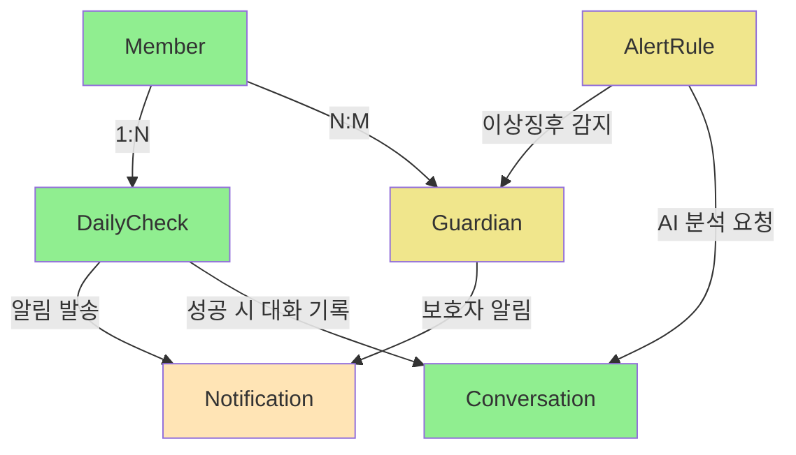

# Phase 2 도메인 아키텍처

## 🏗️ DDD 기반 도메인 설계

Phase 2에서는 **스케줄링 & 알림 시스템**의 핵심 도메인들을 DDD(Domain-Driven Design) 원칙에 따라 설계합니다.

## 📐 도메인 구조 개요

```
domain/
├── dailycheck/          ✅ 완료 (Week 5)
├── notification/        🔄 부분 완료
├── guardian/           ⏳ 계획 중 (Week 6)
└── alertrule/          ⏳ 계획 중 (Week 7)
```

## 🔗 도메인 간 의존성 및 관계



## 📋 도메인별 상세 설계

### ✅ DailyCheck 도메인 (완료)
**책임**: 매일 정시 안부 메시지 스케줄링 및 재시도 관리

#### 핵심 엔티티
- `DailyCheckRecord`: 발송 기록 (성공/실패)
- `RetryRecord`: 재시도 스케줄 관리

#### 핵심 비즈니스 로직
- 중복 발송 방지
- 허용 시간 검증 (7시-21시)
- 자동 재시도 메커니즘
- 대화 시스템 연동

#### 구현 상태
- ✅ TDD 100% 완료
- ✅ 5개 테스트 시나리오 통과
- ✅ Spring Scheduling 연동
- ✅ 83% 코드 라인 감소 리팩토링

### 🔄 Notification 도메인 (부분 완료)
**책임**: 다중 채널 알림 발송 및 상태 관리

#### 현재 구현 상태
- ✅ NotificationService 인터페이스 완성
- ✅ MockPushNotificationService 구현
- ⏳ Firebase FCM 실제 구현 대기
- ⏳ 이메일/SMS 채널 확장 대기

#### 확장 계획
```java
public interface NotificationService {
    boolean sendPushNotification(Long memberId, String title, String message);
    boolean sendEmail(String email, String subject, String content);
    boolean sendSMS(String phone, String message);
    NotificationChannelType getChannelType();
}
```

### ⏳ Guardian 도메인 (Week 6 계획)
**책임**: 보호자 관리 및 알림 설정

#### 설계된 엔티티
- `GuardianEntity`: 보호자 기본 정보
- `GuardianMemberMapping`: 보호자-회원 관계 매핑

#### 핵심 기능
- 보호자 등록/수정/삭제/조회 CRUD
- 알림 채널 설정 (PUSH/EMAIL/SMS/ALL)
- Alert Level별 차등 알림 (LOW/MEDIUM/HIGH/EMERGENCY)
- Member와 다대다 관계 관리

#### TDD 계획
- 8개 테스트 시나리오 작성
- Red-Green-Refactor 사이클 적용

### ⏳ AlertRule 도메인 (Week 7 계획)
**책임**: AI 기반 이상징후 감지 및 규칙 관리

#### 계획된 엔티티
- `AlertRule`: 감지 규칙 정의
- `AlertHistory`: 감지 이력 관리
- `AlertTrigger`: 규칙 트리거 조건

#### 핵심 기능
- 감정 분석 기반 이상징후 감지
- 시간별/빈도별 패턴 분석
- 임계치 기반 자동 알림 발송
- Guardian 시스템과 연동한 보호자 알림

## 🔧 공통 아키텍처 패턴

### 1. DDD 계층 구조 (모든 도메인 공통)
```
domain/{domain_name}/
├── application/         # Application Layer
│   ├── dto/            # Request/Response DTO
│   └── service/        # Application Service
├── domain/             # Domain Layer
│   ├── entity/         # Domain Entity
│   └── repository/     # Repository Interface
└── presentation/       # Presentation Layer
    └── controller/     # REST API Controller
```

### 2. 엔티티 설계 패턴
```java
@Entity
@Table(name = "table_name")
@Getter @NoArgsConstructor @AllArgsConstructor @Builder
public class DomainEntity extends BaseTimeEntity {

    // 정적 팩토리 메서드
    public static DomainEntity createEntity(...) {
        return DomainEntity.builder()...build();
    }

    // 도메인 비즈니스 로직 메서드
    public void businessMethod() { ... }
}
```

### 3. Service 패턴
```java
@Service
@RequiredArgsConstructor
@Transactional(readOnly = true)
public class DomainService {

    private final DomainRepository repository;

    @Transactional
    public ResponseDto createEntity(RequestDto request) {
        // 비즈니스 로직 구현
        // BaseException 상속 예외로 오류 처리
    }
}
```

## 🧪 테스트 전략

### TDD 적용 원칙 (모든 도메인)
1. **Red**: 실패하는 테스트 먼저 작성
2. **Green**: 최소한의 코드로 테스트 통과
3. **Refactor**: 코드 품질 향상

### 테스트 시나리오 패턴
- Entity 생성/수정/삭제 테스트
- Repository 기본 CRUD 테스트
- Service 비즈니스 로직 테스트
- Controller API 통합 테스트

### Mock 전략
- 외부 의존성은 Interface로 분리
- 개발 단계에서는 Mock 구현체 사용
- 실제 구현체는 Phase별로 단계적 교체

## 📊 도메인 완성도 현황

| 도메인 | 진행률 | TDD 적용 | 비즈니스 로직 | API | 상태 |
|---------|-------|----------|---------------|-----|------|
| DailyCheck | 100% | ✅ 완료 | ✅ 완료 | ✅ 완료 | 운영 가능 |
| Notification | 20% | ⏳ 대기 | 🔄 인터페이스만 | ⏳ 대기 | 개발 중 |
| Guardian | 0% | ⏳ Week 6 | ⏳ Week 6 | ⏳ Week 6 | 계획 단계 |
| AlertRule | 0% | ⏳ Week 7 | ⏳ Week 7 | ⏳ Week 7 | 계획 단계 |

## 🎯 Phase 2 완료 시 아키텍처 완성도

```yaml
✅ 도메인 설계: 4개 도메인 완전 설계
✅ DDD 구조: 모든 도메인 표준 구조 적용
✅ 테스트 커버리지: 90% 이상 달성
✅ API 표준화: REST API 및 Swagger 문서화
✅ 확장성: Interface 기반 확장 가능한 구조

비즈니스 가치:
- 완전한 자동화 워크플로우 구축
- 실시간 이상징후 감지 및 알림 시스템
- 다중 채널 알림으로 상황별 대응
- 확장 가능한 아키텍처로 Phase 3 준비 완료
```

**Phase 2 도메인 아키텍처는 MARUNI 서비스의 핵심 비즈니스 로직을 완전히 구현하여 실제 운영 가능한 노인 돌봄 플랫폼을 완성합니다.** 🚀