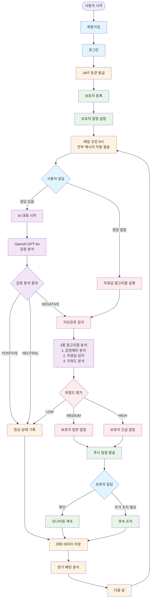
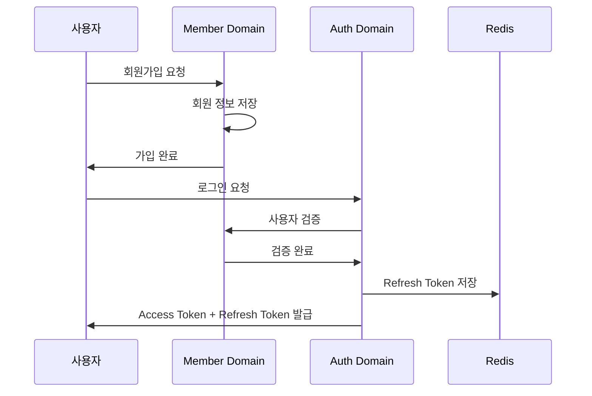
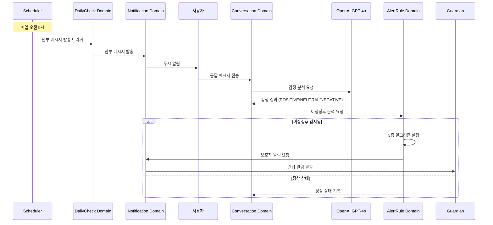
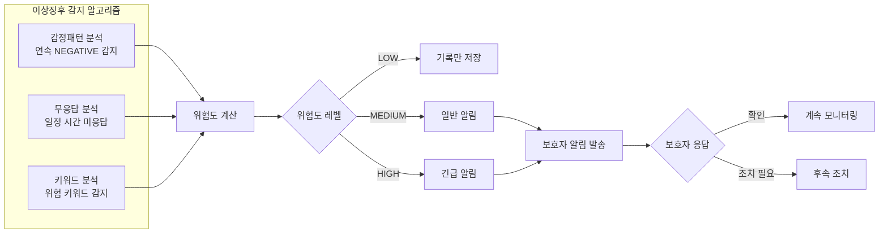
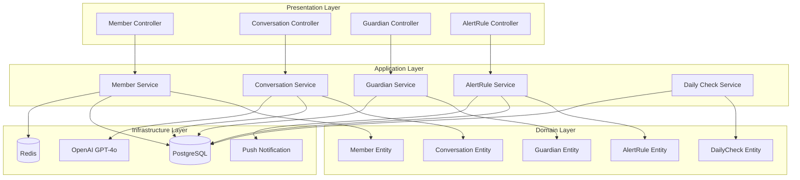

# MARUNI 사용자 흐름 다이어그램

## 전체 사용자 플로우

## 도메인별 상세 플로우

### 1. 인증 및 회원 관리 플로우

### 2. 일일 안부 및 AI 대화 플로우

### 3. 이상징후 감지 및 보호자 알림 플로우

### 4. 시스템 아키텍처 플로우

## 핵심 비즈니스 프로세스

### 매일 안부 확인 프로세스
1. **자동 스케줄링**: 매일 오전 9시 Cron 작업 실행
2. **메시지 발송**: 등록된 모든 사용자에게 안부 메시지 발송
3. **응답 대기**: 사용자 응답을 24시간 동안 대기
4. **AI 분석**: 응답이 오면 OpenAI GPT-4o로 감정 분석
5. **이상징후 감지**: 3종 알고리즘으로 위험 요소 분석
6. **보호자 알림**: 필요시 보호자에게 즉시 알림 발송

### 사용자 상태 모니터링
- **실시간 감지**: 대화 중 위험 키워드 즉시 감지
- **패턴 분석**: 장기간 감정 변화 추이 모니터링
- **무응답 추적**: 연속 무응답 시 자동 알림 증가
- **보호자 연동**: 다단계 알림으로 신속한 대응 지원

이 다이어그램들은 MARUNI 프로젝트의 완성된 시스템 플로우를 보여줍니다. Phase 3 확장 계획 시 참고하실 수 있습니다.